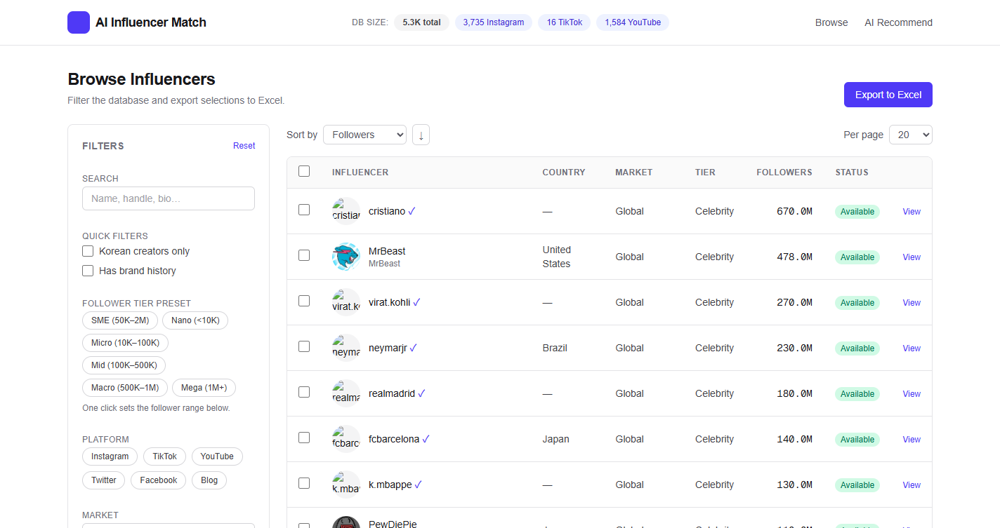
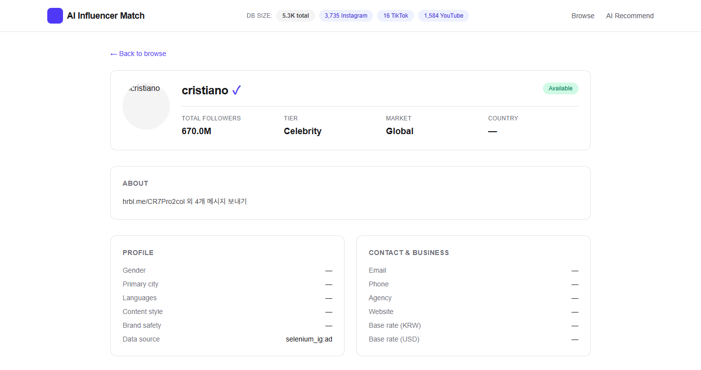
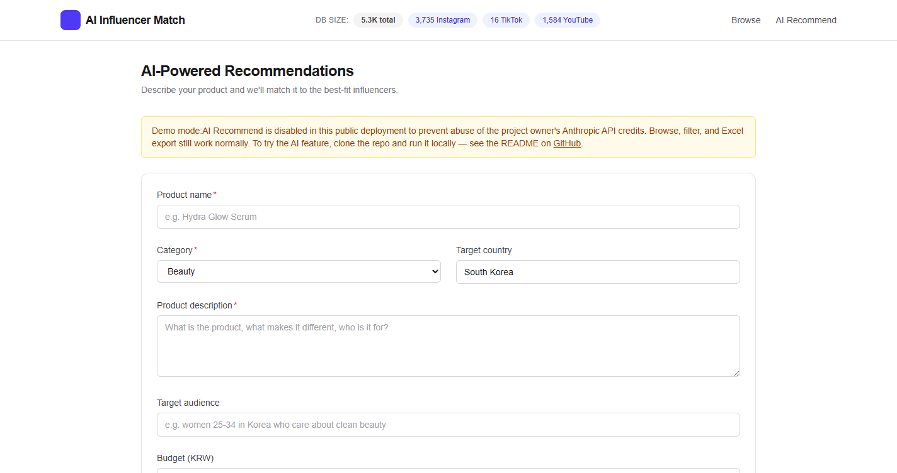

<h1 align="center">AIIM — AI Influencer Match</h1>
<h3 align="center">Creator discovery & brand matching across YouTube, Instagram, TikTok</h3>

<p align="center">
  <em>An end-to-end, cloud-deployed platform for finding the right creator for a marketing campaign.</em><br>
  <sub>Native-language hashtag discovery · LLM-based demographics & brand-deal enrichment · Multi-platform ingestion · Korean + global markets</sub>
</p>

<p align="center">
  
  
  
  
  
  
  
  
</p>

<p align="center">
  <b>Live demo:</b> <a href="https://aiim-frontend-559416574965.asia-northeast3.run.app/">aiim-frontend-559416574965.asia-northeast3.run.app</a><br>
  <sub>(Deployed 24/7 on Cloud Run · Seoul region · asia-northeast3)</sub>
</p>

---

## 🇰🇷 프로젝트 소개 (한국어)

**AIIM (AI Influencer Match)** 은 브랜드 마케팅 팀이 수많은 소셜 미디어 크리에이터 중에서 캠페인에 가장 적합한 인플루언서를 찾을 수 있도록 돕는 엔드투엔드 클라우드 플랫폼입니다. YouTube Data API v3, Meta Graph API, 그리고 자체 개발한 Selenium 인스타그램 스크래퍼를 병렬로 운영해 **14개 언어권에서 5,000명 이상의 크리에이터**를 지속적으로 수집하고, **Claude Haiku 4.5 LLM** 파이프라인으로 각 프로필의 국가·언어·브랜드 협업 이력·콘텐츠 카테고리(뷰티·패션·푸드·라이프스타일 등)를 자동 정제합니다. 복잡도 측면에서는 서로 다른 특성을 가진 세 가지 수집 파이프라인(할당량 10K/day로 제한되는 YouTube Data API, 비즈니스 계정에만 접근 가능한 Meta Graph API, 사람과 유사한 패턴으로 24시간 운영되는 병렬 Selenium 워커 두 대)을 LLM 기반 데이터 보강 층과 통합하면서, **Google Cloud(Cloud Run + Cloud SQL + Secret Manager + Artifact Registry)** 위에서 24/7 안정적으로 서비스합니다. **유의미한 결과**로는 ① 영어 구문 검색이 수렴하던 한계를 넘어 다국어 해시태그(`광고`·`スポンサー`·`رعاية` 등 14개 문자 체계) 기반 검색 전략 한 번의 30분 실행으로 YouTube 신규 크리에이터 **400명** 확보, ② 인스타그램 프로필 바이오 자동 분석을 통한 비즈니스 연락 이메일 **323건** 추출, ③ 자연어로 제품을 설명하면 AI가 근거와 함께 적합한 크리에이터 순위를 반환하는 **추천 엔진** 구현, ④ `probe-before-bulk` 원칙과 실시간 비용 추적으로 유료 API(Anthropic·YouTube·Meta)의 월간 운영 비용을 예측 가능한 범위에서 관리한 점이 있습니다.

---

## 🎯 What is this?

Finding the right influencer for a brief is a research problem. Marketing teams spend days scrolling through platforms, cross-referencing follower counts, checking demographics, and reading comments to guess whether a creator's audience matches a brand's target market. **AIIM collapses that into a single search + ranking pipeline:**

1. **Discovery** — continuously ingests creators from the YouTube Data API, the Instagram Graph API, and a purpose-built Selenium scraper, normalising them into a unified schema.
2. **Enrichment** — an LLM reads each creator's bio, recent captions, and brand mentions, then structures them into searchable fields: primary language, audience country mix, vertical (beauty / fashion / food / lifestyle / tech), brand-deal history, monetisation intent.
3. **Matching** — given a brief ("mid-tier K-beauty creator with engaged Southeast-Asian audience"), the recommendation engine returns a ranked shortlist with human-readable reasoning for every pick.

---

## 📊 Current data footprint

| Platform | Creators ingested |
|:---------|---:|
| Instagram | **3,735** |
| YouTube | **1,584** |
| TikTok | 16 *(scraper vendor suspended — see note below)* |
| **Total** | **~5,300 unique creators** |

Creators span **14 languages / scripts** — Korean, Japanese, Chinese (S/T), Thai, Vietnamese, Indonesian, Filipino, Arabic, Hindi, Turkish, Portuguese, Spanish, German, Italian, Russian, English. The ingestion pipeline intentionally searches **native-language monetisation hashtags** (`광고`, `スポンサー`, `رعاية`, `publicidade`, `iklan`, …) because English-phrase queries on YouTube always converge on the same pre-discovered Anglo-creator pool.

---

## 🎨 Product screenshots

<p align="center">
  
  <br><em>Browse view. Live header counts pull straight from Cloud SQL (5.3K total · 3,735 Instagram · 1,584 YouTube · 16 TikTok). Faceted filter sidebar — follower-tier presets (Nano → Celebrity), platform, market, Korean-creators-only, has-brand-history. Primary table shows handle + verified tick + country + market + tier + follower count. Sortable, paginated, and one-click exportable to Excel.</em>
</p>

<p align="center">
  
  <br><em>Per-creator detail page. Top card has the canonical handle, verified state, follower count, engagement tier, market scope, country. Below: a 2-column panel for LLM-enriched attributes (gender, city, languages, content style, brand safety) and another for business contact (email, phone, agency, website, base rate in KRW + USD). "Data source" is stamped so I can trace every row back to the exact hashtag or search term that surfaced it.</em>
</p>

<p align="center">
  
  <br><em>AI Recommend. Describe the product, target audience, and budget in plain English — the backend runs a Claude-powered recommendation pipeline against the enriched creator pool and returns a ranked shortlist with per-pick reasoning. The amber banner is a first-class feature: <b>demo-mode gating</b> disables this endpoint on the public demo so visitors can't burn through my Anthropic credits, but everything else (browse / filter / export) stays fully live. Same codebase runs both — one env flag away.</em>
</p>

---

## 🛠 Tech Stack

**Backend**
- **Python 3.10** · FastAPI · SQLAlchemy · Alembic
- **PostgreSQL** on Cloud SQL (`db-f1-micro`, single source of truth)
- **Anthropic Claude API** — `claude-haiku-4-5` for demographics enrichment, brand-collab extraction, and the recommendation engine, with prompt caching to keep unit economics sane

**Frontend**
- **Next.js 14** (App Router, standalone build for Cloud Run)
- **TypeScript** · Tailwind CSS · shadcn/ui
- Server components where they help, client components where they don't

**Data ingestion**
- **YouTube Data API v3** — quota-budgeted daily scraper deployed as a Cloud Run Job
- **Meta Graph API / Instagram Business Discovery** — rate-limited at 200 calls/hr, paced with 25 s sleep between calls
- **Selenium workers** — for the public-IG signal the Graph API doesn't expose: hashtag corpora, commenter graph, bio mentions. Parallelised across two Chrome profiles on a disjoint hashtag slice

**Cloud / infra**
- **Google Cloud Platform** end-to-end
- **Cloud Run** for backend + frontend (autoscaling, pay-per-request)
- **Cloud SQL Postgres** as the single source of truth
- **Artifact Registry** for container images
- **Cloud Build** for CI (separate pipelines for backend / frontend / scraper)
- **Secret Manager** for API keys (never baked into images)

---

## ☁️ Architecture

```
┌──────────────────────────────────────────────────────────────┐
│  Data sources                                                │
│  ┌──────────┐  ┌──────────┐  ┌────────────────────────────┐  │
│  │ YouTube  │  │ Meta IG  │  │ Selenium IG workers        │  │
│  │  API v3  │  │  Graph   │  │  (hashtag + commenter      │  │
│  │          │  │  API     │  │   graph, parallelised)     │  │
│  └────┬─────┘  └────┬─────┘  └────────────┬───────────────┘  │
└───────┼─────────────┼─────────────────────┼──────────────────┘
        ▼             ▼                     ▼
┌────────────────────────────────────────────────────────────┐
│  Ingestion services (Python, idempotent upserts)           │
│  influencer → platform_account → platform_metadata         │
│                                                            │
│  LLM enrichment passes (Claude Haiku, prompt-cached):      │
│     demographics · brand collabs · vertical classification │
└───────────────────────────┬────────────────────────────────┘
                            ▼
                    ┌────────────────┐
                    │  Cloud SQL     │
                    │  Postgres      │
                    └───────┬────────┘
                            ▼
            ┌───────────────────────────┐
            │  FastAPI (Cloud Run)      │
            │   /api/search             │
            │   /api/influencer/{id}    │
            │   /api/recommend  (LLM)   │
            │   /api/export/xlsx        │
            └──────────────┬────────────┘
                           ▼
            ┌───────────────────────────┐
            │  Next.js (Cloud Run)      │
            │  Browse · filter · detail │
            │  Excel export · AI match  │
            └───────────────────────────┘
```

---

## 🎯 Engineering choices I'm proud of

**Cost discipline as a first-class concern.** After burning a paid scraper vendor's monthly budget in a single day because of a 50× cost mis-estimate, I adopted a hard *probe-one-before-bulk* rule for every paid API and track per-call spend in operational notes so every next decision is informed by real numbers. The post-mortem lives in the private repo as `feedback_cost_discipline.md` — the single most useful doc in the project.

**Graceful degradation.** If Meta Graph or YouTube quota hits the ceiling mid-run, ingesters commit per-row, log clean summaries, and resume on the next invocation. No multi-hour scrape ever loses work to a mid-run failure — including the DNS blips and browser-process crashes that periodically kill a Selenium run.

**Human-shaped Selenium.** The IG scraper uses μs-precision randomised dwell times, mouse wander, a break scheduler (with ~8% probability of a "walked away from the desk" 5–15 min AFK), a resilient author-selector hierarchy that survives IG's frequent DOM churn, and persistent Chrome profiles so login state carries across runs. Multi-hour sessions on my personal account run for weeks without a single challenge wall.

**Parallel workers, shared dedup.** A second Selenium worker runs a disjoint hashtag slice in a separate Chrome profile. Both workers commit to the same Cloud SQL; `platform_account` upserts are idempotent so collision is free, and the only coordination needed is disjoint tag assignment.

**Demo-mode gating.** The public demo keeps the browse / filter / Excel-export paths fully open but disables the `/api/recommend` endpoint so visitors can't burn through the Anthropic credits that power it. Same codebase, one env flag apart between prod and dev. (You can see the amber banner explaining this on the screenshot above.)

**Multilingual discovery beats phrase-query discovery.** Instead of re-running English phrase queries that converge on the same top-10 channels, I feed YouTube's `search.list` single-word monetisation hashtags in 14 scripts. A single 30-minute run added **400 new channels** when the equivalent English-phrase runs had plateaued at near-zero per day.

---

## 🔒 Why the source is private

This is a personal portfolio project built on a handful of paid APIs (Anthropic, Meta, YouTube) and a scraping stack tuned for a specific IG account. Publishing the full source would:
- expose rate-limiting workarounds I'd rather not document publicly,
- let bots re-use my prompts and burn through my Anthropic credits,
- leak the DB seed data.

**Recruiters / collaborators:** happy to give repo access on request — ping me at the email on my GitHub profile.

---

## 📄 License

All rights reserved. © 2026 jeonhs9110.
